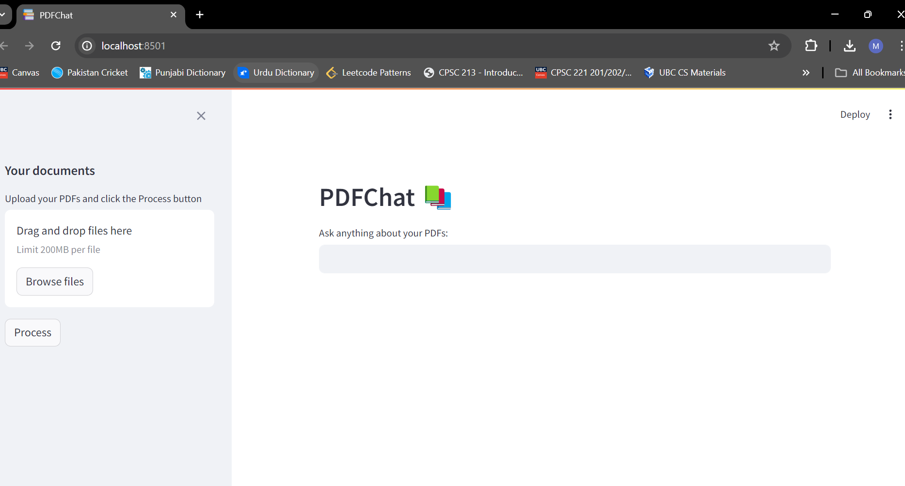
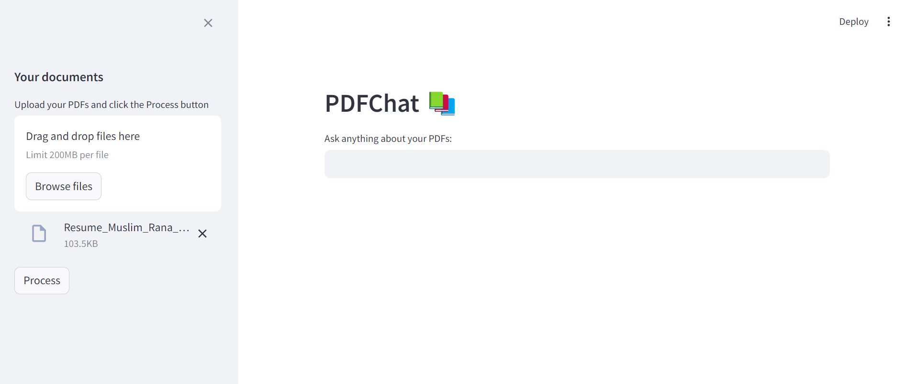
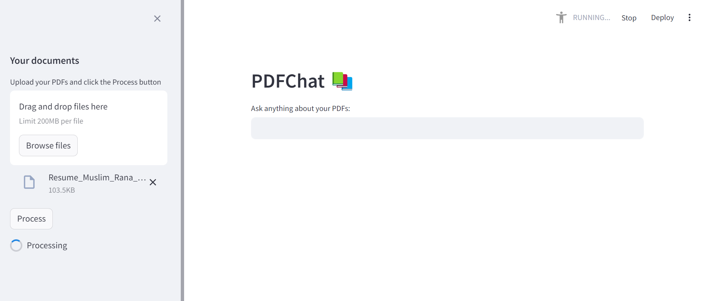
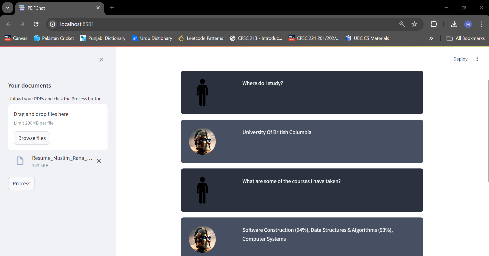

# PDFChat

## Table Of Contents
- Overview
- Core Concepts
- Languages, Libraries, and Dependencies
- Demo

## Overview

This project uses generative artificial intelligence to create a model which learns from your own custom PDF files which you can upload. The model will use LLM APIs in order to learn and then answer questions about your documents. Your questions require no specific syntax or formatting, ask whatever type of question in any type of format, using the power of GenAI this model will be able to respond. This project is a personal ChatGPT for your own PDFs!!!!

## Core Concepts

- Generative Artifical Intelligence
- Large Language Models (LLMs)
- ChatBots
- APIs
- Data Persistence
- Vector Embeddings
- Vector Databases
- GUIs and frontend design

## Languages, Libraries, and Dependencies

- Python
- LangChain
- PyPDF2
- dotenv
- Streamlit
- OpenAI
- HuggingFaceHub
- FAISS

## Demo

In this demo I have passed my PDFChat application my own resume I will query different questions about my resume. Let's see how it performs!

- Below is the initial loading screen:

- Now I have pressed the upload button and submitted my resume as a PDF document:

- Now I have pressed the process button. The GenAI model is currently learning all the information it can from my resume:

- Finally, I have asked it various different questions about my resume (the robot picture is the AI model, the stickman is the human):

Pretty accurate!